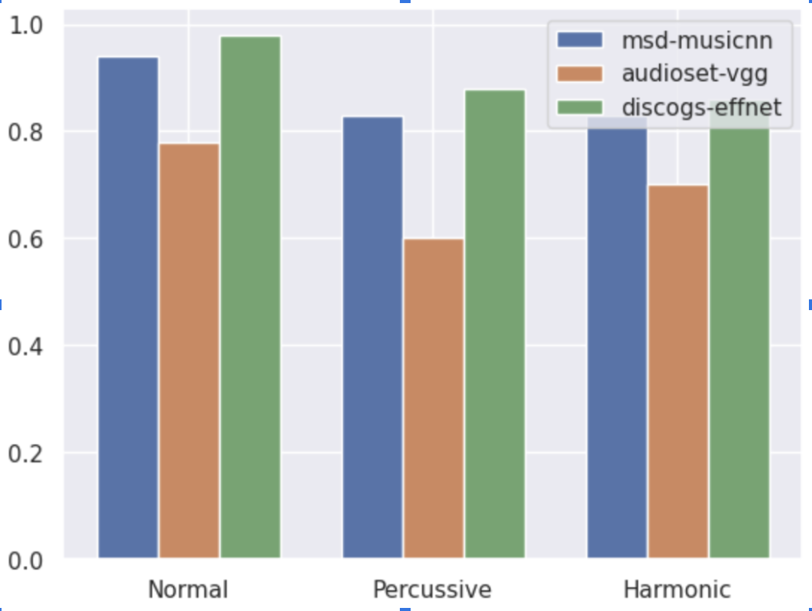

# Music Genre Classification with Deep Embeddings

This project focuses on classifying music genres using deep learning models. The goal is to utilize audio embeddings from deep neural networks to categorize songs into predefined genres. This is a typical task in music information retrieval (MIR) where the model learns to recognize patterns in audio data that correspond to specific musical genres.

## Table of Contents

- [Dataset](#dataset)
- [Evaluation](#evaluation)
- [Results](#results)
- [Contributing](#contributing)
- [License](#license)

## Dataset

The dataset used for this project is the **GTZAN Music Genre Dataset**, which is publicly available on Kaggle. The dataset can be accessed [here](https://www.kaggle.com/datasets/andradaolteanu/gtzan-dataset-music-genre-classification).

This dataset consists of 1,000 audio tracks categorized into 10 music genres. It is commonly used for music genre classification tasks.

For more information on how to use this dataset, please refer to the Kaggle page linked above.

## Results

## Contributing

If you'd like to contribute to this project, feel free to fork the repository and submit a pull request. Contributions are welcome!

## License

This project is licensed under the MIT License - see the [LICENSE](LICENSE) file for details.
